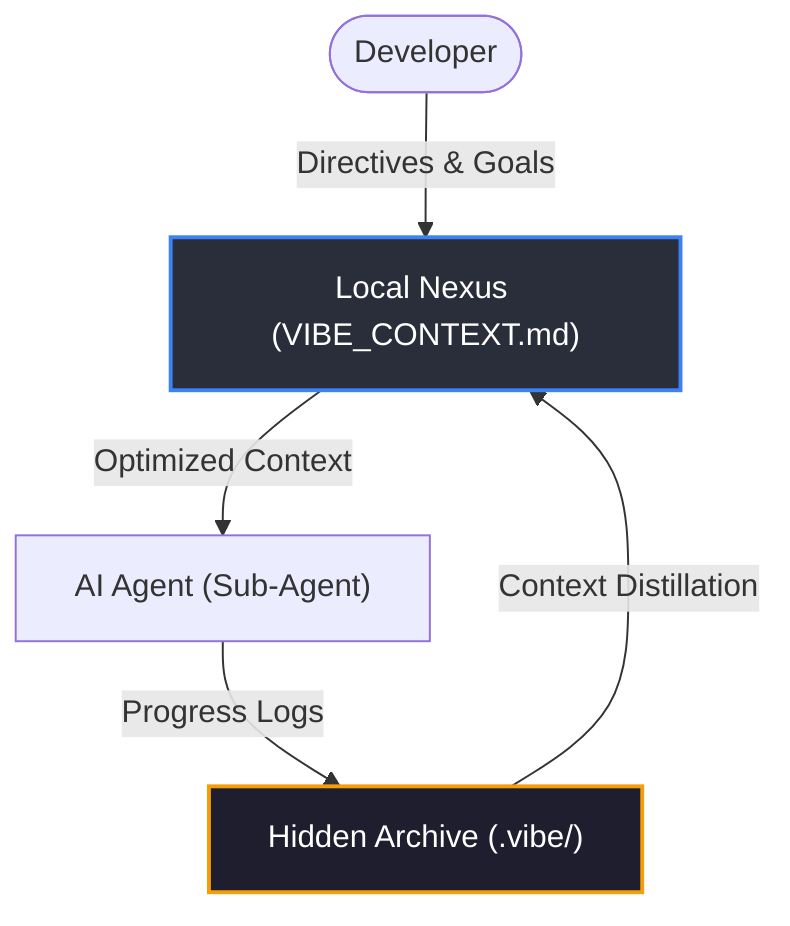
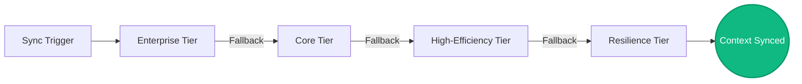

# 🌊 Vibe-Sync
### *The Reliable Context Engine for Agentic AI Workflows*

**Vibe-Sync** is a high-performance framework designed to solve the "context-drift" problem in modern AI-assisted development. By maintaining a persistent and synchronized **Source of Truth**, Vibe-Sync ensures that AI agents can "boot up" into any project with complete architectural clarity, minimizing token waste and maximizing productivity.

---

## 🏗️ Architecture: The Context Bridge

Vibe-Sync creates a seamless link between your development environment and your AI collaborators, ensuring that every strategic decision and milestone is captured and preserved.

### **1. Multi-Tiered Inference Reliability**
A robust fallback protocol ensuring synchronization even during API outages or quota limits.

---

## 🌟 Core Features

### **🔒 Local-First Privacy (The Nexus)**
Your project's "vibe" is stored in `VIBE_CONTEXT.md`. This file serves as the local source of truth and is **never pushed to global repositories**. It remains on your local machine, serving as a secure, private bridge for your AI collaborators.

### **🕰️ The Hidden Archive (.vibe/)**
Vibe-Sync maintains a complete, hidden record of your project's evolution in the `.vibe/` directory. Our **Adaptive Token Engines** periodically distill these granular logs into high-level milestones, maintaining a ~70% token efficiency gain for every new agent session.

### **📦 The Vibe Bundle (Workspace Synthesis)**
For deep-dive analysis, the **Vibe Bundle** synthesizes your entire workspace into a high-density, AI-optimized format for rapid ingestion, allowing agents to understand complex codebases in seconds.

---

## 🛠️ Command Portfolio

| Command | Focus | Impact |
| :--- | :--- | :--- |
| `vibe-sync init` | **Setup** | Initializes the local context core and metadata audit. |
| `vibe-sync commit` | **Sync** | Portals recent changes into the Nexus via the Inference Cascade. |
| `vibe-sync status` | **Audit** | Summarizes current project health and context telemetry. |
| `vibe-sync push` | **Transfer** | Injects the active project vibe into an agent's persistent memory. |
| `vibe-sync bundle` | **Synthesis** | Generates a high-density, AI-ready snapshot of the codebase. |
| `vibe-sync install-hooks` | **Automation** | Deploys background triggers for automatic context updates. |

---

### **🏆 Team Apex**
- **Aravind Krishnan S** — *Lead Architect*
- **Pranav P** — *Systems Optimization*

---
© 2026 Team Apex. High-Performance Context Orchestration.
